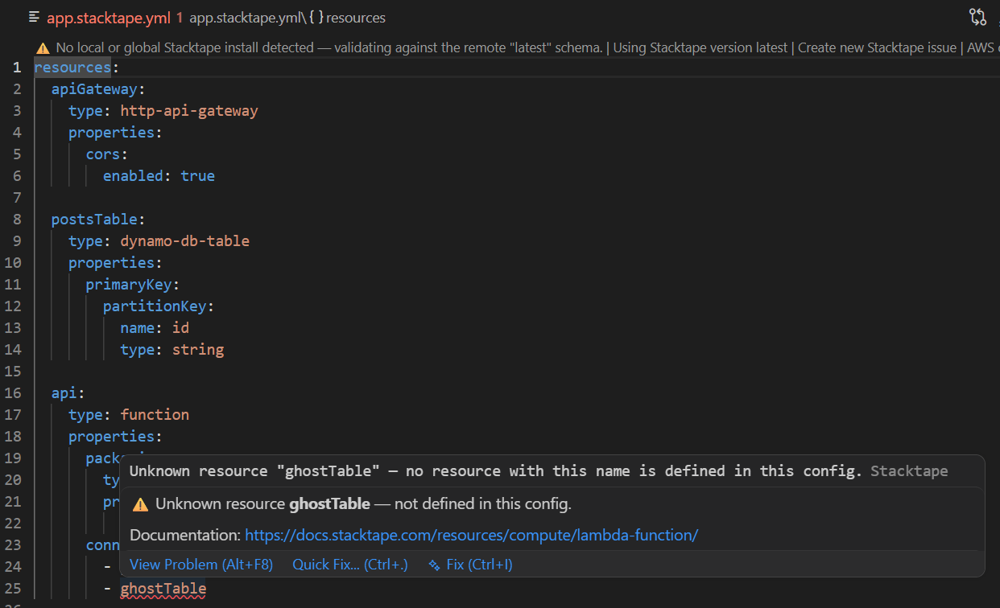

# Stacktape for VS Code

Validation, autocomplete, hover documentation, and CLI commands for [Stacktape](https://stacktape.com) configuration
files.

[Website](https://stacktape.com) • [Docs](https://docs.stacktape.com/) •
[Sign up](https://console.stacktape.com/sign-up)



## Features

- **Validation** — validates your config against the Stacktape schema, and flags `$ResourceParam` / `$CfResourceParam` /
  `$Var` directives and `connectTo` entries that reference a resource or variable not defined in the file.
- **Autocomplete** — schema-driven completion, plus completion of your resource/variable names inside directives (e.g.
  `$ResourceParam('…')`).
- **Hover documentation** — property descriptions with links to the matching page on docs.stacktape.com, and a preview
  of what a directive reference points to.
- **Go to definition** — jump from a `$ResourceParam` / `$Var` argument or a `connectTo` entry to where that
  resource/variable is defined.
- **CLI commands** — run **Validate**, **Preview** (diff), and **Deploy** for the current config without leaving the
  editor.

## File detection

The extension activates for files named `*stacktape.yml`, `*stp.yml`, `*stacktape.yaml`, `*stp.yaml` (and their
`.debug.` variants). These open as the dedicated **Stacktape** language, so the extension works alongside the official
YAML extension without conflicting on your other YAML files.

## Schema resolution

The config schema and version are resolved automatically, in this order:

1. **Local project install** — `node_modules/stacktape` (version from its `package.json`).
2. **Global install** — `~/.stacktape/bin`.
3. **Bundled schema** — built from the monorepo's canonical schema and available offline.
4. **Remote** — the latest published schema, used only if the packaged copy is unavailable.

The code lens at the top of a config shows the schema source and warns when validation may not match your installed CLI
version.

## Development

This extension lives in the Stacktape monorepo. From the repository root:

```sh
pnpm dev:vscode-extension
pnpm --filter vscode-stacktape test
pnpm package:vscode-extension
```

The language server uses the maintained `yaml-language-server` package. The code under `src/language-server` adds only
Stacktape schema resolution, directive and `connectTo` references, and the schema code lens. The build embeds
`packages/config/generated/config-schema.json`; do not copy or edit a second schema.

## Commands

Available from the editor title bar, the editor right-click menu, and the Command Palette when a Stacktape config file
is open (including TypeScript configs, `*.stacktape.ts`):

| Command                           | CLI                  |
| --------------------------------- | -------------------- |
| Stacktape: Validate config        | `stacktape validate` |
| Stacktape: Preview changes (diff) | `stacktape diff`     |
| Stacktape: Deploy stack           | `stacktape deploy`   |

Commands prompt for the target stage and AWS region (remembered per workspace) and run in an integrated terminal,
preferring a locally installed CLI (`node_modules/.bin`) and falling back to a global install on your `PATH`.

## Settings

| Setting                        | Default | Description                                                                                                             |
| ------------------------------ | ------- | ----------------------------------------------------------------------------------------------------------------------- |
| `stacktape.validate`           | `true`  | Enable/disable validation.                                                                                              |
| `stacktape.hover`              | `true`  | Enable/disable hover documentation.                                                                                     |
| `stacktape.completion`         | `true`  | Enable/disable autocompletion.                                                                                          |
| `stacktape.validateReferences` | `true`  | Flag references to resources/variables not defined in the file. Turn off if your config is split across multiple files. |
| `stacktape.defaultStage`       | `""`    | Default stage prefilled for CLI commands.                                                                               |
| `stacktape.defaultRegion`      | `""`    | Default AWS region prefilled for CLI commands.                                                                          |
| `stacktape.profile`            | `""`    | AWS profile passed to CLI commands.                                                                                     |
| `stacktape.trace.server`       | `off`   | Trace communication with the language server.                                                                           |

## Requirements

- VS Code 1.82 or newer.
- The [Stacktape CLI](https://docs.stacktape.com/) — required for the Validate / Preview / Deploy commands.

## License

MIT
