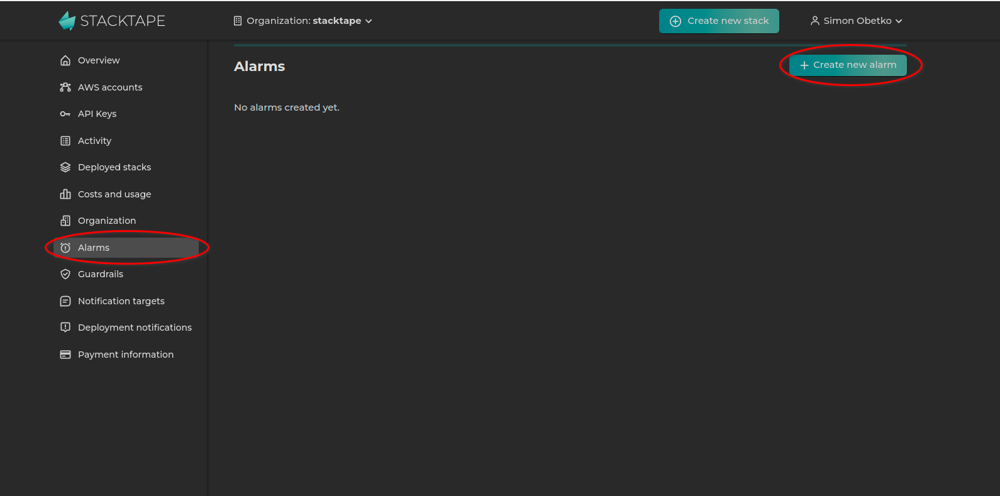
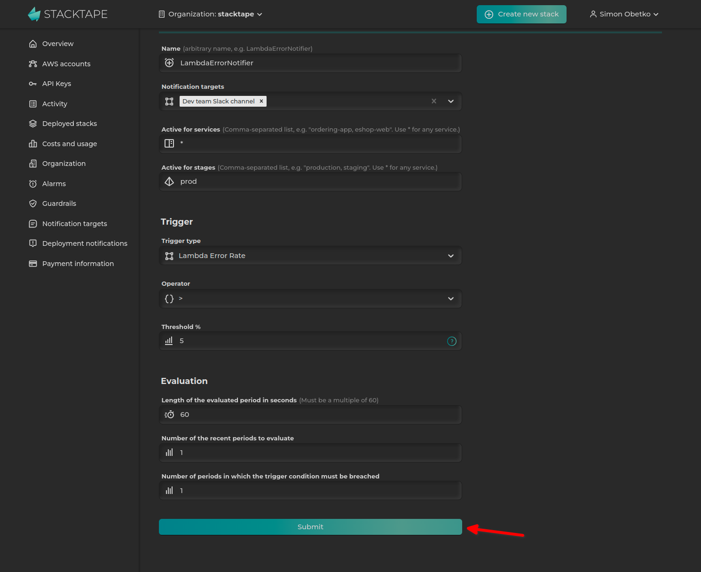

<br />
<br />

Alarms offer a straightforward way to monitor your infrastructure and receive prompt notifications when your resources experience issues or become overloaded.

You can configure alarms to monitor specific metrics of a resource type. When a metric crosses a predefined threshold, the alarm triggers a configured action, such as sending a notification.

Under the hood, Stacktape alarms are implemented using _CloudWatch Alarm_s.

## How to create alarms

There are two ways to create alarms:

*   **Global alarms** are created in the Stacktape Console and apply to all resources of a specific type managed by Stacktape.
*   **In-config alarms** are defined directly within a resource's configuration in your `stacktape.yml` file.

## Global alarms

Global alarms are templates created in the [Stacktape Console](https://console.stacktape.com/alarms). When you deploy a stack that matches the alarm's `serviceName` and `stage` criteria, Stacktape creates a concrete alarm for each eligible resource in that stack.

When configuring a global alarm, you can specify:

*   The resource type and metric to monitor.
*   The threshold for the metric.
*   Automatic **Slack** or **email** notifications.
*   The stacks the alarm applies to, based on `serviceName` and `stage`.

<Warning>

Global alarms only apply to stacks that are created or updated **after** the alarm is created. If you create a global alarm, you must run the `stacktape deploy` command to apply it to your existing stacks.

</Warning>

### Creating a global alarm

1.  Navigate to the [Alarms page](https://console.stacktape.com/alarms) in the Stacktape Console and click **Create new alarm**.

    

2.  Configure the alarm. The example below shows an alarm that monitors the error rate of Lambda functions and is limited to the `prod` stage.

    

3.  Deploy your stack using the `stacktape deploy` command to create the alarms.

## In-config alarms

You can define alarms directly in your `stacktape.yml` file as a property of the resource you want to monitor.

`embed:alarms/basic.stp.yml`

An in-config alarm consists of three parts:

*   **Trigger**: Specifies the metric to monitor.
*   **Notifications** (optional): Defines where to send notifications when the alarm is triggered.
*   **Evaluation** (optional): Configures the evaluation period for the monitored metric.

<PropertiesTable definitionName="LambdaAlarm" />

### Trigger

The trigger specifies the metric to be monitored.

<PropertiesTable definitionName-="LambdaErrorRateTrigger" />

```yml
resources:
  myLambdaFunction:
    type: function
# ...
# {start-highlight}
    alarms:
      - trigger:
          type: lambda-error-rate
          properties:
            thresholdPercent: 5
# {stop-highlight}
```

<Info>

See the [Trigger Types](#trigger-types) section for a list of all available alarms.

</Info>

### Notifications

You can configure notifications to be sent to Slack, MS Teams, or by email.

**Slack:**

```yml
resources:
  myResource:
    type: ...
    properties:
# ...
      alarms:
        - trigger:
# ...
# {start-highlight}
          notificationTargets:
            - type: slack
              properties:
                conversationId: C038XXXXXX
                accessToken: $Secret('slack-access-token')
# {stop-highlight}
```

**MS Teams:**

```yml
resources:
  myResource:
    type: ...
    properties:
# ...
      alarms:
        - trigger:
# ...
# {start-highlight}
          notificationTargets:
            - type: ms-teams
              properties:
                webhookUrl: MY_WEBHOOK_URL
# {stop-highlight}
```

**Email:**

```yml
resources:
  myResource:
    type: ...
    properties:
# ...
      alarms:
        - trigger:
# ...
# {start-highlight}
          notificationTargets:
            - type: email
              properties:
                sender: alarm@company.com
                recipient: support@company.com
# {stop-highlight}
```

### Evaluation

The evaluation section configures the evaluation period for the monitored metric.

<PropertiesTable definitionName="AlarmEvaluation" />

```yml
resources:
  myResource:
    type: ...
    properties:
# ...
      alarms:
        - trigger:
# ...
# {start-highlight}
          evaluation:
            period: 200
# {stop-highlight}
```

## Trigger a Lambda function on alarm

You can trigger a Lambda function when an alarm is fired. For more information, see the [alarm event documentation](/compute-resources/functions/#alarm-event).

## Trigger types

<Info>
  New trigger types are added regularly. If you have a request for a new trigger, please open a
  [GitHub issue](https://github.com/stacktape/stacktape/issues/new).
</Info>

### Lambda Error Rate

<PropDescription definitionName="LambdaErrorRateTriggerProps" propertyName="threshold" descType="ld" />
<PropertiesTable definitionName="LambdaErrorRateTrigger" />

### Lambda Duration

<PropDescription definitionName="LambdaDurationTriggerProps" propertyName="threshold" descType="ld" />
<PropertiesTable definitionName="LambdaDurationTrigger" />

### Database Read Latency

<PropDescription definitionName="RelationalDatabaseReadLatencyTriggerProps" propertyName="threshold" descType="ld" />
<PropertiesTable definitionName="RelationalDatabaseReadLatencyTrigger" />

### Database Write Latency

<PropDescription definitionName="RelationalDatabaseWriteLatencyTriggerProps" propertyName="threshold" descType="ld" />
<PropertiesTable definitionName="RelationalDatabaseWriteLatencyTrigger" />

### Database CPU Utilization

<PropDescription definitionName="RelationalDatabaseCPUUtilizationTriggerProps" propertyName="threshold" descType="ld" />
<PropertiesTable definitionName="RelationalDatabaseCPUUtilizationTrigger" />

### Database Free Storage

<PropDescription definitionName="RelationalDatabaseFreeStorageTriggerProps" propertyName="threshold" descType="ld" />
<PropertiesTable definitionName="RelationalDatabaseFreeStorageTrigger" />

### Database Free Memory

<PropDescription definitionName="RelationalDatabaseFreeMemoryTriggerProps" propertyName="threshold" descType="ld" />
<PropertiesTable definitionName="RelationalDatabaseFreeMemoryTrigger" />

### Database Connection Count

<PropDescription
  definitionName="RelationalDatabaseConnectionCountTriggerProps"
  propertyName="threshold"
  descType="ld"
/>
<PropertiesTable definitionName="RelationalDatabaseConnectionCountTrigger" />

### Http Api Gateway Error Rate

<PropDescription definitionName="HttpApiGatewayErrorRateTriggerProps" propertyName="threshold" descType="ld" />
<PropertiesTable definitionName="HttpApiGatewayErrorRateTrigger" />

### Http Api Gateway Latency

<PropDescription definitionName="HttpApiGatewayLatencyTriggerProps" propertyName="threshold" descType="ld" />
<PropertiesTable definitionName="HttpApiGatewayLatencyTrigger" />

### Application Load Balancer Error Rate

<PropDescription definitionName="ApplicationLoadBalancerErrorRateTriggerProps" propertyName="threshold" descType="ld" />
<PropertiesTable definitionName="ApplicationLoadBalancerErrorRateTrigger" />

### Application Load Balancer Custom

<PropDescription definitionName="ApplicationLoadBalancerCustomTriggerProps" propertyName="metric" descType="ld" />
<PropertiesTable definitionName="ApplicationLoadBalancerCustomTrigger" />

### Sqs Queue Received Messages

<PropDescription definitionName="SqsQueueReceivedMessagesCountTriggerProps" propertyName="threshold" descType="ld" />
<PropertiesTable definitionName="SqsQueueReceivedMessagesCountTrigger" />

### Sqs Queue Not Empty

<PropDescription definitionName="SqsQueueNotEmptyTrigger" propertyName="type" descType="ld" />
<PropertiesTable definitionName="SqsQueueNotEmptyTrigger" />
