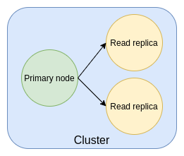
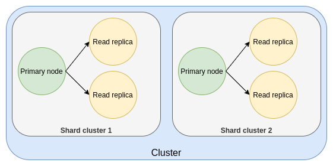

 
 

Redis is a fast, in-memory, _NoSQL_ data store that provides sub-millisecond latency. It's often used as a cache to offload primary database systems, but it's also suitable for chat applications, message queues, and real-time analytics.

With Stacktape, you can deploy a fully managed Redis cluster without worrying about capacity scaling, hardware provisioning, cluster setup, patching, or backups. The service is compatible with open-source Redis, so you can use your existing Redis clients.

Under the hood, Stacktape uses [Amazon ElastiCache for Redis](https://aws.amazon.com/elasticache/redis/).

# When to use it

Redis is an excellent choice when performance is critical.

<NegativeMargin />

## Advantages

- **Performance:** As an in-memory data store, Redis can deliver sub-millisecond response times, making it an order of magnitude faster than disk-based databases.
- **Fully managed:** Stacktape handles all the operational overhead, including scaling, provisioning, patching, and backups.
- **High availability:** Supports both clustered and non-clustered modes and provides automatic failover with minimal impact.

## Disadvantages

- **Data persistence:** While Redis offers persistence options like snapshotting and append-only files, it's not as durable as a transactional database with full logging and point-in-time recovery.
- **Memory limitations:** All of your data must fit in memory.
- **Client complexity:** Clients connecting to a Redis cluster need to be aware of the cluster's topology, which can require additional configuration.

# Basic usage

This example shows a simple, single-node Redis cluster. The only required properties are `instanceSize` and `defaultUserPassword`.

`embed:redis-clusters/basic-usage.stp.yml`

> A Lambda function connected to a single-node Redis cluster.

`embed:redis-clusters/basic-usage.ts`

> Example code for storing and retrieving data from the cluster.

# Instance size

<PropDescription definitionName="RedisClusterProps" propertyName="instanceSize" descType="ld" />

`embed:redis-clusters/node-size.stp.yml`

# Default user password

<PropDescription definitionName="RedisClusterProps" propertyName="defaultUserPassword" descType="ld" />

`embed:redis-clusters/node-size.stp.yml`

# Cluster topology

The topology of your cluster, determined by the number of replica nodes and shards, affects its performance and availability.

## Single-node cluster

A single-node cluster has only one node and is not highly available.

`embed:redis-clusters/topology-single-node.stp.yml`

<Divider />

## Multi-node cluster

You can add replica nodes to a non-sharded cluster to improve read performance and availability.

<PropDescription definitionName="RedisClusterProps" propertyName="numReplicaNodes" descType="ld" />

`embed:redis-clusters/topology-multi-node.stp.yml`

<Divider />

## Sharded cluster

For horizontally scaled performance, you can enable sharding to distribute data across multiple primary nodes.

<PropDescription definitionName="RedisClusterProps" propertyName="enableSharding" descType="ld" />

`embed:redis-clusters/topology-sharded.stp.yml`

`embed:redis-clusters/using-sharded-cluster.ts`

> Using a sharded cluster from a Lambda function.

# Logging

You can enable logging to send the Redis [slow log](https://redis.io/commands/slowlog) to a CloudWatch log group.

`embed:redis-clusters/logging.stp.yml`

<PropertiesTable definitionName="RedisLogging" searchForReferencesInDefinition="RedisClusterProps" />

## Forwarding logs

You can forward logs to third-party services. See [Forwarding Logs](/configuration/log-forwarding/) for more information.

# Accessibility

You can configure which resources can access your cluster. Redis clusters don't support public IP addresses, so only two access modes are available.

<PropertiesTable definitionName="RedisAccessibility" searchForReferencesInDefinition="RedisClusterProps" />

## VPC mode

The cluster is only accessible from resources within the default _VPC_. This includes any function, batch job, or container workload in your stack.

`embed:redis-clusters/accessibility-vpc.stp.yml`

## Scoped VPC mode

This mode is more restrictive. In addition to being in the same _VPC_, a resource must explicitly list the cluster in its `connectTo` property to gain access.

`embed:redis-clusters/accessibility-scoping-vpc.stp.yml`

# Referenceable parameters

<ReferenceableParams resource="redis-cluster" />

# Pricing

You are charged for:

- **Nodes:** The price depends on the instance size, number of shards, and number of replica nodes.
  - **Formula:** `num_shards * (num_replica_nodes + 1) * price_per_node`
  - **Example 1 (cheapest):** A single-node `cache.t3.micro` cluster costs **$0.017/hour** (~$12.50/month).
  - **Example 2 (sharded):** A two-shard `cache.t3.micro` cluster with one replica per shard costs **$0.068/hour** (~$49/month).
- **Data transfer:** Usually no additional cost.
- **Backups:** Free for the first day of retention, then $0.085/GB per month.

 

**Free Tier** (first 12 months)

- 750 hours of `t2.micro` or `t3.micro` instances per month.

 

To learn more, see the [AWS pricing page](https://aws.amazon.com/elasticache/pricing/?nc=sn&loc=5).

# API Reference

<PropertiesTable definitionName="RedisCluster" />
