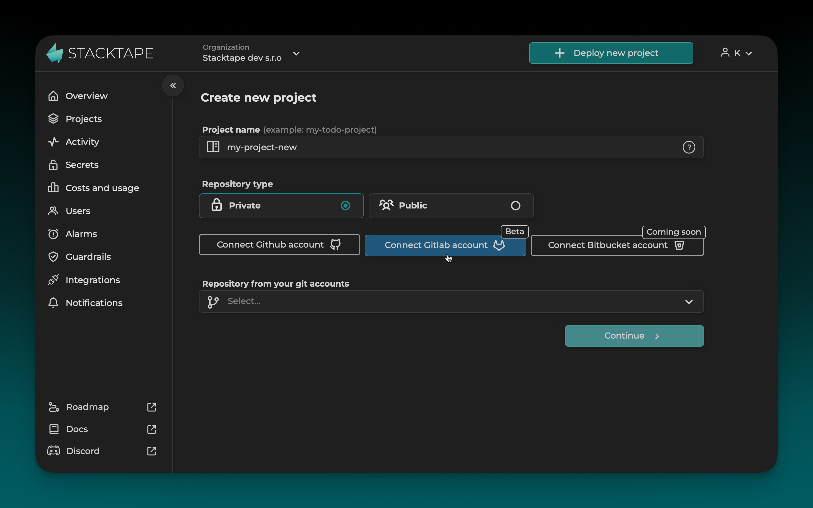
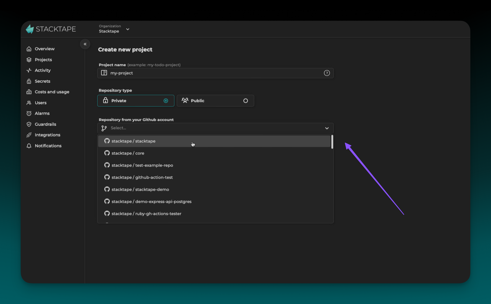
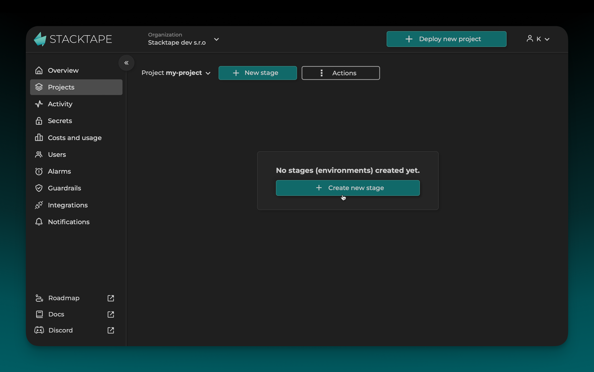
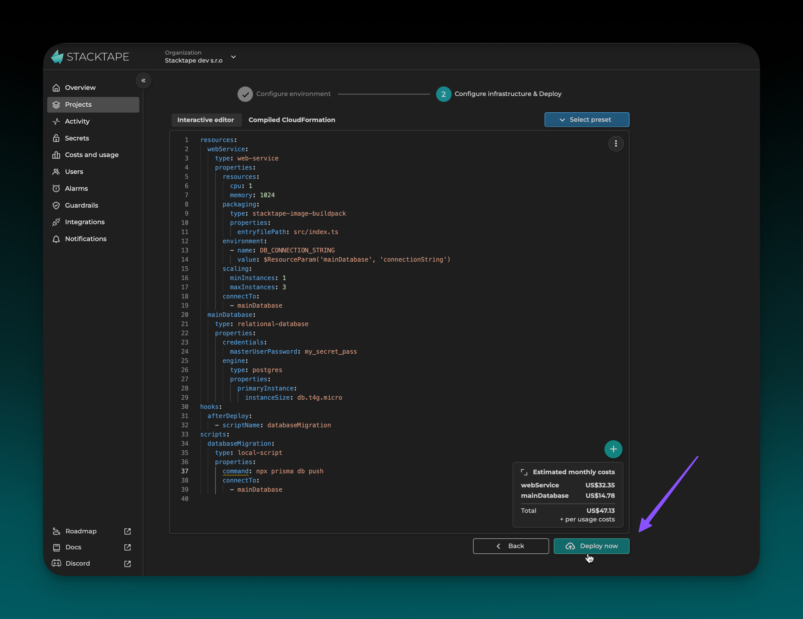
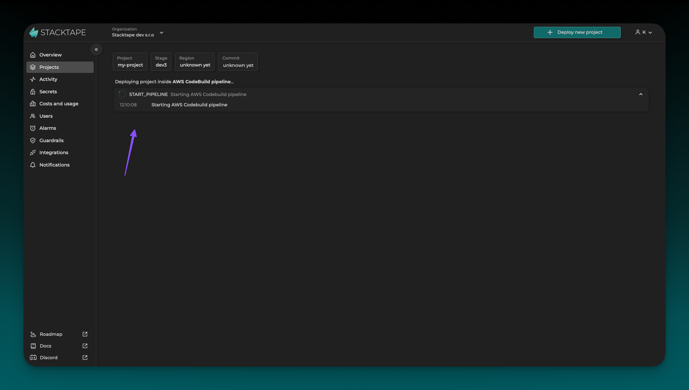

 
 

You can deploy your application directly from the [Stacktape console](https://console.stacktape.com/) by connecting it to your Git repository.

## Prerequisites

Before you begin, make sure you have the following:

-   A **Stacktape account**.
-   An **AWS account** connected to your Stacktape organization.
-   A **Git repository** containing your application code and a `stacktape.yml` or `stacktape.ts` file.

## 1. Create a Project

First, create a new Stacktape project. In the console, click **Deploy new project** and select **Git project using console**.

### Enter a project name

Enter a name for your project.

### Connect your Git repository

Connect your GitHub or GitLab account to Stacktape.

### Select a repository

Select the repository you want to deploy.

Finally, click **Continue**.

## 2. Deploy a Stage

Once you've created a project, you can deploy a new stage. On the project page, click **Create new stage**.

### Configure stage details

-   **Branch:** The Git branch you want to deploy.
-   **Commit:** The specific commit you want to deploy.
-   **Stage:** A name for your new stage (e.g., `production`, `staging`).
-   **AWS Account:** The AWS account you want to deploy to.

### Create a Stacktape configuration

If your repository doesn't have a `stacktape.yml` or `stacktape.ts` file, you can create one using the [interactive config editor](/getting-started/using-config-editor).

### Deploy

Click **Deploy now** to start the deployment.

You can monitor the deployment progress in the console. Once it's complete, you'll be redirected to the stack details page.

<PreviousNext
  left={{ url: "/getting-started/under-the-hood/", title: "Under the Hood" }}
  right={{ url: "/getting-started/deploying-using-CLI/", title: "Deploying with the CLI" }}
/>
