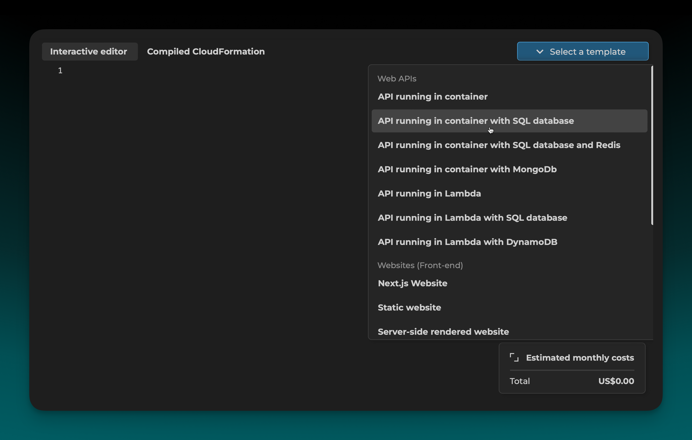
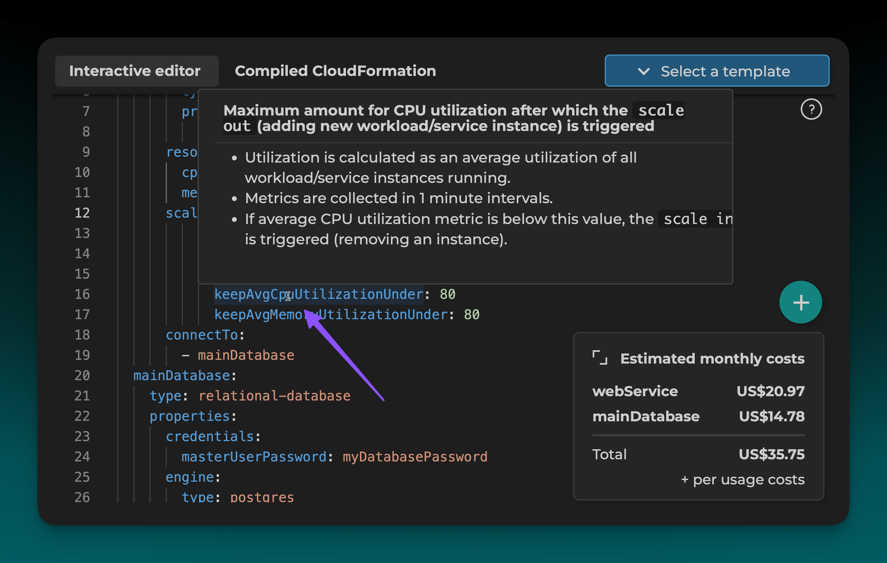
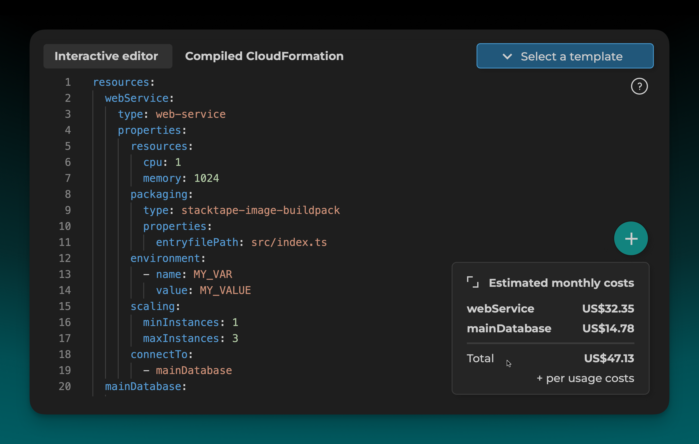
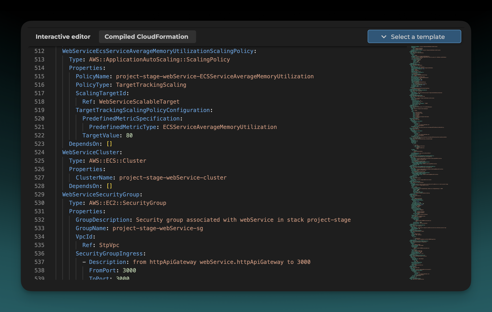

 
 

The interactive config editor is the easiest way to write your Stacktape configuration. It provides a rich, interactive experience with features like auto-completion, validation, and built-in documentation.

### 1. Select a Preset

Start by selecting a preset to generate a basic configuration for your application.

### 2. Configure Resource Details

Click on the capitalized, green properties to open a configuration modal and adjust the resource details.

### 3. View Built-in Documentation

Hover over any property to see its documentation.

### 4. Estimate Costs

As you configure your resources, the editor will automatically estimate their monthly cost.

### 5. Add More Properties

To see all available properties for a resource, you can trigger auto-completion by pressing `Ctrl` + `Space`.

### 6. View Generated CloudFormation

Click the **Compiled CloudFormation** tab to see the generated _CloudFormation_ template for your stack.

<Info>

Note that this template is not 100% correct, and the one that Stacktape uses for your application will differ slightly.

</Info>

### 7. Add More Resources

Click the **+** button to add more Stacktape or _CloudFormation_ resources to your stack.

### 8. Add Deployment Scripts

You can also use the **+** button to add deployment scripts for tasks like database migrations.

<PreviousNext
  left={{ url: "/getting-started/configuring-stack/", title: "Configuring a Stack" }}
  right={{ url: "/getting-started/under-the-hood/", title: "Under the Hood" }}
/>
