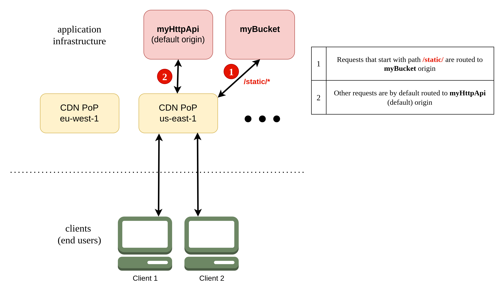

 
 

A Content Delivery Network (CDN) is a geographically distributed network of servers that work together to provide fast delivery of internet content. By caching content in locations closer to your users, a _CDN_ can significantly reduce latency and decrease the load on your application's origin servers. It can also improve security by providing a layer of defense against DDoS attacks.

Under the hood, Stacktape uses [Amazon CloudFront](https://aws.amazon.com/cloudfront/), which has over 300 points of presence (PoPs) worldwide.

# How a CDN works

A _CDN_ acts as a layer between your application (the origin) and your clients.

- Instead of sending requests directly to your application, clients send them to the _CDN_.
- The _CDN_ routes the request to the nearest PoP.
- The PoP retrieves the response from your application (the origin).
- The PoP sends the response to the client and caches it for future requests.
- Subsequent requests for the same content can be served directly from the cache (a cache hit), which is much faster.

You can control which responses are cached and for how long. See the section on [cache control](#cache-control) for more information.

# Basic usage

In Stacktape, you configure a _CDN_ on a resource, which then becomes the default origin for the _CDN_. You can use a _CDN_ with a [bucket](#cdn-with-a-bucket), [HTTP API Gateway](#cdn-with-an-http-api-gateway), or [Application Load Balancer](#cdn-with-an-application-load-balancer).

`embed:cdns/basic-bucket.stp.yml`

You can also configure [route rewrites](#route-rewrites) to forward requests for specific paths to different origins. This allows you to create hybrid infrastructures where, for example, static content is served from a bucket and dynamic content is served from an API.

<PropertiesTable definitionName="CdnConfiguration" />

# CDN with a bucket

You can enable a _CDN_ for a bucket with just two lines of configuration. By default, content from the bucket is cached for six months. This is a common pattern for serving static websites.

`embed:cdns/basic-bucket.stp.yml`

# CDN with an HTTP API Gateway

You can also enable a _CDN_ for an HTTP API Gateway. By default, the _CDN_ does not cache any content from an API gateway, as it's assumed to be dynamic. You can control the caching behavior by setting the `Cache-Control` header in your API's responses.

`embed:cdns/http-api-gateway.stp.yml`

# CDN with an Application Load Balancer

Similarly, you can enable a _CDN_ for an Application Load Balancer. As with an API gateway, content is not cached by default.

`embed:cdns/application-load-balancer.stp.yml`

<Divider />

# Custom domain names

<PropDescription definitionName="CdnConfiguration" propertyName="customDomains" descType="ld" />

<PropertiesTable definitionName="DomainConfiguration" searchForReferencesInDefinition="CdnConfiguration" />

`embed:http-api-gateways/cdn-domain-names.stp.yml`

<Divider />

# Edge Lambda functions

You can run Lambda functions at the edge to customize the content that the _CDN_ delivers. For more information, see the [Edge Lambda Functions](/compute-resources/edge-lambda-functions) page.

<PropDescription definitionName="CdnConfiguration" propertyName="edgeFunctions" descType="ld" />

<PropertiesTable definitionName="EdgeFunctionsConfig" searchForReferencesInDefinition="CdnConfiguration" />

`embed:cdns/cdn-lambda-basic.stp.yml`

<Divider />

# Cache control

You can control the caching behavior of the _CDN_ in two ways:

1.  **Using the `Cache-Control` header (recommended):** This gives you fine-grained control over the caching behavior for each response from your origin.
2.  **Using CDN caching options:** This allows you to set basic caching rules but is less flexible.

<Warning>

Stacktape automatically invalidates the entire _CDN_ cache after each successful deployment. This ensures that your users always receive the latest version of your content. You can disable this behavior in the [automatic invalidation](#automatic-invalidation) settings.

</Warning>

<Divider />

## Cache-Control header with buckets

You can set the `Cache-Control` header for objects in a bucket using metadata. When you use the [directory upload](/other-resources/buckets/#directory-upload) feature, Stacktape can automatically set the correct headers for you using presets.

`embed:cdns/bucket-with-upload.stp.yml`

<Divider />

## Cache-Control header with an HTTP API Gateway or Application Load Balancer

When using a _CDN_ with an API gateway or an ALB, you can set the `Cache-Control` header in the responses from your application.

`embed:cdns/http-api-gateway-with-lambda.stp.yml`

`embed:cdns/hello.ts`

> A Lambda function that returns a response with a `Cache-Control` header.

For more information on the `Cache-Control` header, see the [MDN docs](https://developer.mozilla.org/en-US/docs/Web/HTTP/Headers/Cache-Control).

<Divider />

## CDN caching options

You can specify default caching behavior for your _CDN_. Different caching options can be set for each [route rewrite](#route-rewrites).

If you don't specify any caching options, Stacktape uses the following defaults:

| Origin type               | minTTL | maxTTL   | defaultTTL |
| ------------------------- | ------ | -------- | ---------- |
| Bucket                    | 0      | 31536000 | 15768000   |
| HTTP API Gateway          | 0      | 31536000 | 0          |
| Application Load Balancer | 0      | 31536000 | 0          |

`embed:http-api-gateways/cdn-caching-options.stp.yml`

<PropertiesTable definitionName="CdnCachingOptions" searchForReferencesInDefinition="CdnConfiguration" />

## Controlling the cache key

The cache key is a unique identifier for each object in the cache. It determines whether a request results in a cache hit. By default, the cache key is based on the URL path, but you can configure it to include headers, cookies, or query parameters.

If you don't specify a cache key, Stacktape uses the following defaults:

| Origin type               | Parts of request included in cache key                 |
| ------------------------- | ------------------------------------------------------ |
| Bucket                    | URL path                                               |
| HTTP API Gateway          | URL path, all query params, and the `Authorization` header |
| Application Load Balancer | URL path, all query params, and the `Authorization` header |

For example, if your origin uses the `Accept-Language` header to return different content based on the client's language, you should include that header in the cache key.

`embed:cdns/cache-key.stp.yml`

<PropertiesTable definitionName="CdnCacheKey" searchForReferencesInDefinition="CdnConfiguration" />

# CDN forwarding options

Forwarding options specify which parts of a request are forwarded to the origin. You can also filter which request methods are forwarded.

If you don't specify any forwarding options, Stacktape uses the following defaults:

| Origin type               | Parts of request forwarded to origin                    |
| ------------------------- | ------------------------------------------------------- |
| Bucket                    | URL path                                                |
| HTTP API Gateway          | URL path, all query params, all headers, and all cookies |
| Application Load Balancer | URL path, all query params, all headers, and all cookies |

`embed:http-api-gateways/cdn-forwarding-options.stp.yml`

<PropertiesTable definitionName="CdnForwardingOptions" searchForReferencesInDefinition="CdnConfiguration" />

# Route rewrites

Route rewrites allow you to route incoming requests to different origins based on the URL path.

<PropDescription definitionName="CdnConfiguration" propertyName="routeRewrites" descType="ld" />

<PropertiesTable definitionName="CdnRouteRewrite" searchForReferencesInDefinition="CdnConfiguration" />

<Divider />

## Routing to a bucket

In this example, requests with a URL path starting with `/static` are routed to a bucket, while all other requests are routed to an HTTP API Gateway.

<PropertiesTable definitionName="CdnBucketRoute" searchForReferencesInDefinition="CdnConfiguration" />

`embed:http-api-gateways/cdn-route-rewrite.stp.yml`

<Divider />

## Routing to an Application Load Balancer

<PropertiesTable definitionName="CdnLoadBalancerRoute" searchForReferencesInDefinition="CdnConfiguration" />

`embed:http-api-gateways/cdn-route-rewrite-lb.stp.yml`

<Divider />

## Routing to an HTTP API Gateway

<PropertiesTable definitionName="CdnHttpApiGatewayRoute" searchForReferencesInDefinition="CdnConfiguration" />

`embed:http-api-gateways/cdn-route-rewrite-http-api.stp.yml`

<Divider />

## Routing to a custom origin

<PropertiesTable definitionName="CdnCustomDomainRoute" searchForReferencesInDefinition="CdnConfiguration" />

`embed:application-load-balancers/cdn-route-rewrite-custom-origin.stp.yml`

# Automatic invalidation

You can disable the automatic cache invalidation that occurs after each deployment by setting `invalidateAfterDeploy` to `false`.

`embed:cdns/disable-invalidation.stp.yml`

# Price class

You can set a price class to reduce the cost of your _CDN_ by limiting the number of edge locations from which it serves traffic.

<PropDescription definitionName="CdnConfiguration" propertyName="cloudfrontPriceClass" descType="ld" />

`embed:cdns/price-class.stp.yml`

# Firewall

You can protect your _CDN_ with a web application firewall.

<PropDescription definitionName="CdnConfiguration" propertyName="useFirewall" descType="ld" />

To learn more, see the [Web Application Firewall](/security-resources/web-app-firewalls/) documentation.

`embed:cdns/firewall.stp.yml`

# API reference

<PropertiesTable definitionName="CacheKeyCookies" searchForReferencesInDefinition="CdnConfiguration" />

<PropertiesTable definitionName="CacheKeyHeaders" searchForReferencesInDefinition="CdnConfiguration" />

<PropertiesTable definitionName="CacheKeyQueryString" searchForReferencesInDefinition="CdnConfiguration" />

<PropertiesTable definitionName="CdnCustomRequestHeader" searchForReferencesInDefinition="CdnConfiguration" />

<PropertiesTable definitionName="ForwardCookies" searchForReferencesInDefinition="CdnConfiguration" />

<PropertiesTable definitionName="ForwardHeaders" searchForReferencesInDefinition="CdnConfiguration" />

<PropertiesTable definitionName="ForwardQueryString" searchForReferencesInDefinition="CdnConfiguration" />

<PropertiesTable definitionName="CdnResponseHeader" searchForReferencesInDefinition="CdnConfiguration" />
