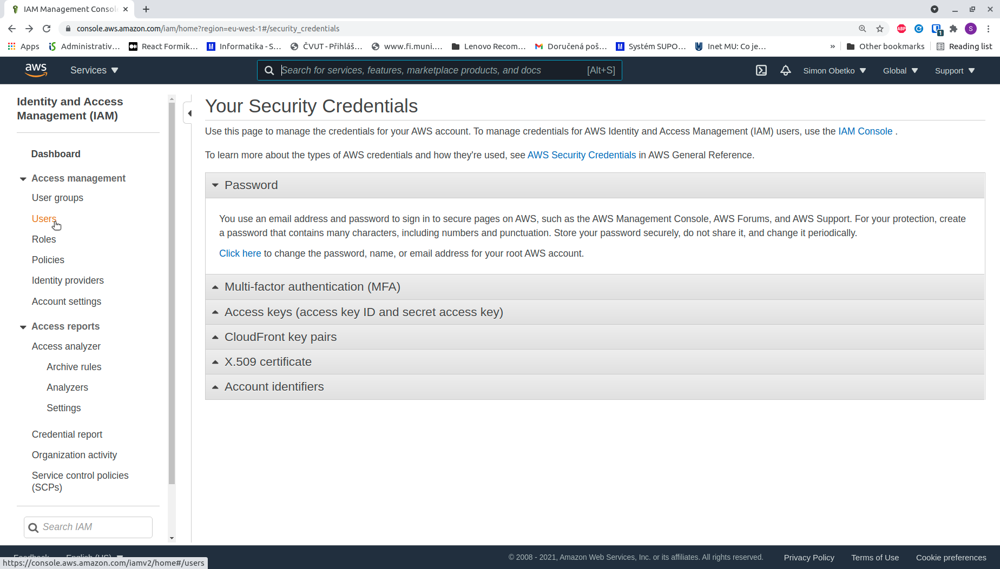
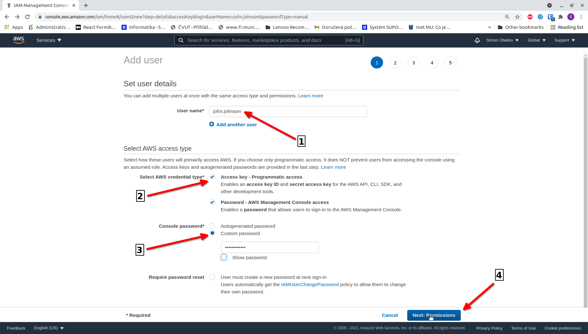
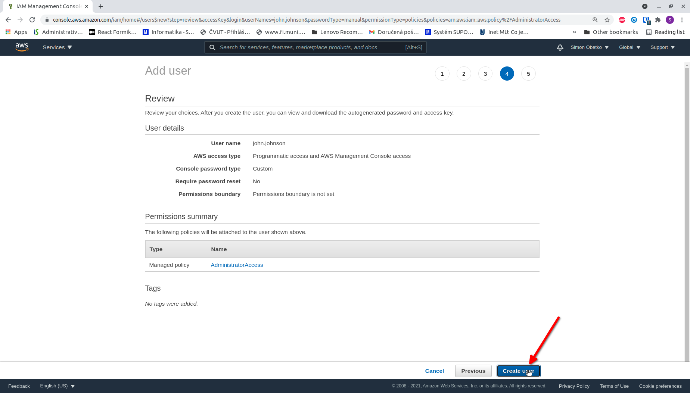

<br />
<br />

To access your AWS account from your local machine, you need to configure AWS credentials (an **AWS Access Key ID** and **AWS Secret Access Key**). Stacktape uses these credentials to interact with your AWS account.

This guide walks you through creating these credentials and configuring your system to use them.

## Create AWS credentials

### 1. Log in to your AWS account

Log in to your AWS account [here](https://console.aws.amazon.com/console/home?nc2=h_ct&src=header-signin).

<Info>

If you already have an IAM user, log in as an IAM user. Otherwise, log in as the root user.

</Info>

### 2. Navigate to My Security Credentials

In the top navigation bar, click on your username and select **My Security Credentials**.


Depending on whether you are logged in as a **root user** or an **IAM user**, you will see different screens and need to perform different actions. If you just created your AWS account, you are logged in as the **root user**.

### 3a. (As a root user) Create an IAM user with credentials

If you are logged in as the **root user**, you will see the following screen on the **My Security Credentials** page:



Using the root user to interact with your account is not recommended. You should create an IAM user instead. To do so, click on the **Users** link in the left-hand navigation panel.


Click on the **Add users** button in the top-right corner of the screen.


In **Step 1**, specify the following:

1.  **User name**: A unique identifier for the user in your account.
2.  **AWS credential type**: Select **Access key - Programmatic access**. If you also want to use this IAM user to log in to the AWS Management Console (which [AWS recommends](https://docs.aws.amazon.com/IAM/latest/UserGuide/id_root-user.html)), also select **Password - AWS Management Console access**.
3.  **Password**: If you selected **Password - AWS Management Console access**, enter a password.
4.  Click **Next: Permissions**.



In **Step 2**, set the permissions for your IAM user:

1.  Select **Attach existing policies directly**.
2.  Check the **AdministratorAccess** box.
3.  Click **Next: Tags**.


In **Step 3**, you do not need to add any tags. Click **Next: Review**.


In **Step 4**, review the user details and click **Create user**.



In **Step 5**, copy the credentials or download them by clicking the **Download .csv** button. Save the credentials, as you will need them to configure the AWS profile on your machine.

If you created an IAM user with console access, you can now log out as the root user and log back in as the newly created IAM user.


### 3b. (As an IAM user) Create credentials for an existing IAM user

If you are logged in as an **IAM user**, you will see the following screen on the **My Security Credentials** page:


Click on the **Create access key** button.


Copy the credentials or download them by clicking the **Download .csv** button. Save the credentials, as you will need them to configure the AWS profile on your machine.


## Configure the AWS profile for your system

To create an AWS profile on your system, you can use the following command:

```bash
stacktape aws-profile:create
```

By default, Stacktape uses the **default** profile. The credentials are saved at `~/.aws/credentials` on Linux and macOS, and at `C:\Users\<USERNAME>\.aws\credentials` on Windows.
