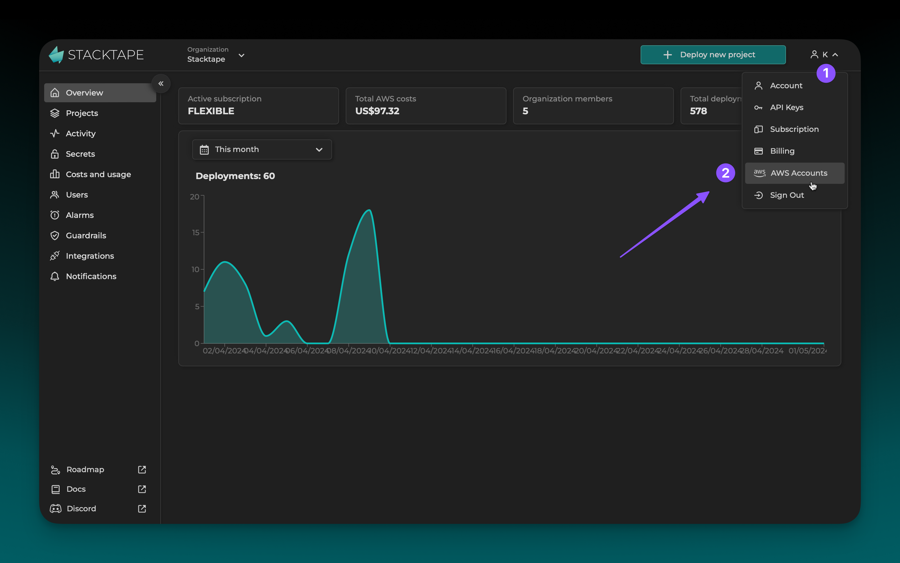
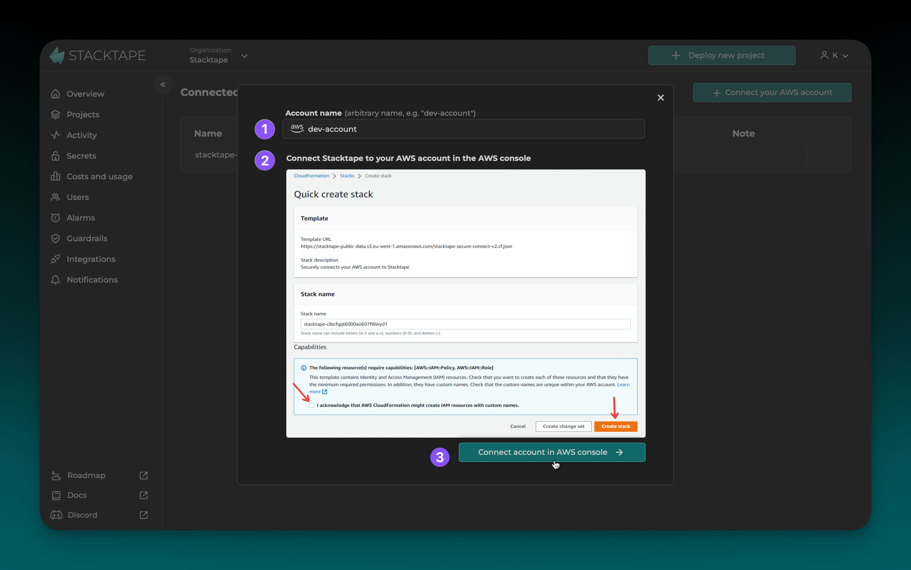
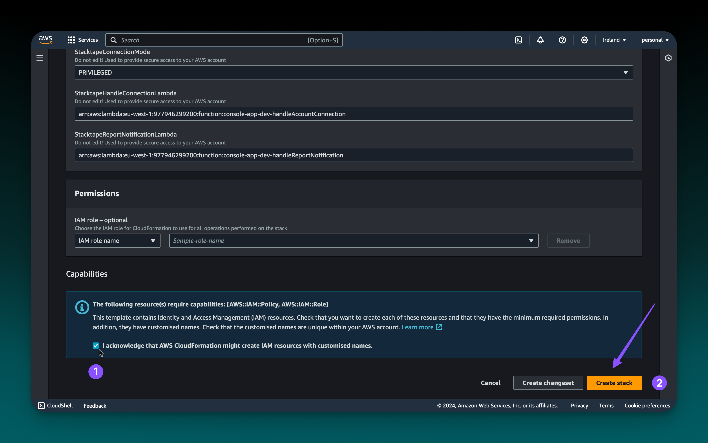
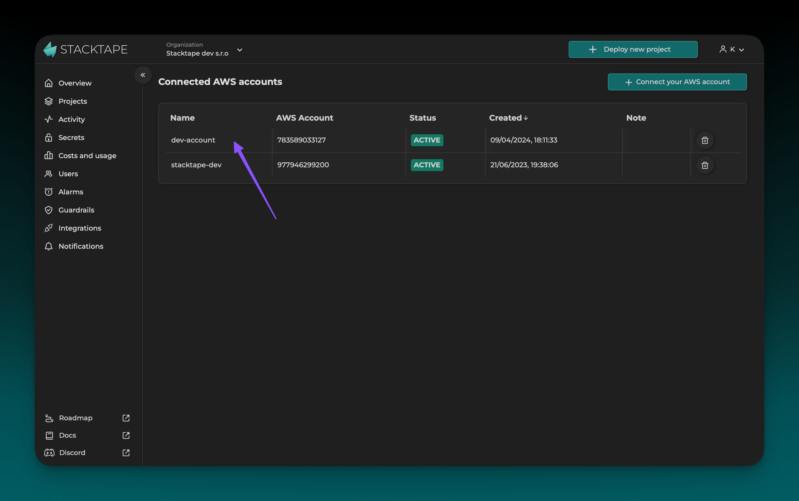

 
 

To deploy with Stacktape, you must have an AWS account connected to your organization. This guide will walk you through the process of connecting your AWS account to Stacktape.

## Prerequisites

You must have an AWS account to complete this tutorial. If you do not have one, you can [create one here](https://portal.aws.amazon.com/billing/signup).

## Step 1: Navigate to the AWS Accounts page

After signing in to the [Stacktape Console](https://console.stacktape.com/), navigate to the [AWS accounts page](https://console.stacktape.com/aws-accounts).

## Step 2: Initiate the connection

Click the **Connect your AWS account** button.

Fill in the **Account name**. This will be used to identify your AWS account within your Stacktape organization. Then, click **Connect Account in AWS Console**. You will be redirected to the AWS Management Console.

## Step 3: Create the connection stack

In the AWS Management Console, you will be prompted to create the connection stack. This is a set of resources that are required for Stacktape to connect to your AWS account. It includes an _S3 bucket_ for collecting cost reports (for Stacktape's cost analysis feature) and an _IAM_ role that allows Stacktape to access your AWS account.

The connection stack and its resources are free and will not incur any noticeable costs.

<Warning>

If you delete the connection stack in the AWS Management Console, you will no longer be able to use Stacktape.

</Warning>

After you confirm the stack creation, the stack will be created. This process usually takes about a minute.

Once the connection stack is created, your AWS account will be connected to Stacktape. You should see the connected AWS account marked as **ACTIVE** on the [AWS accounts page](https://console.stacktape.com/aws-accounts) in the Stacktape Console.

