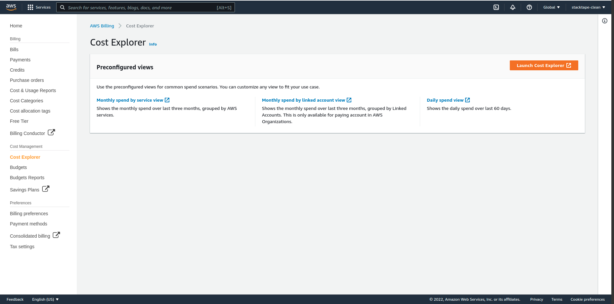
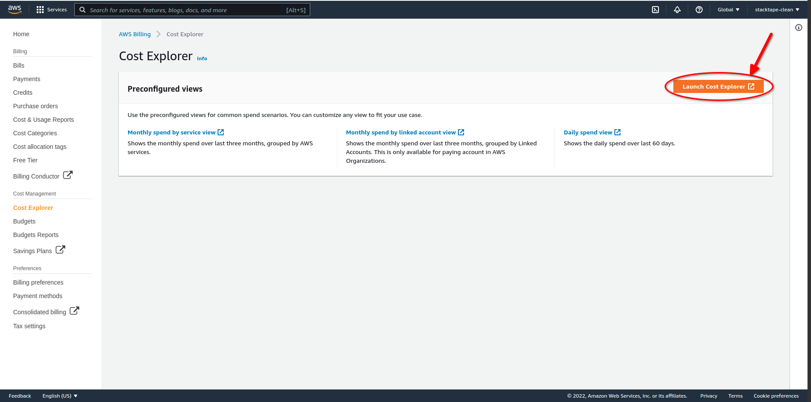
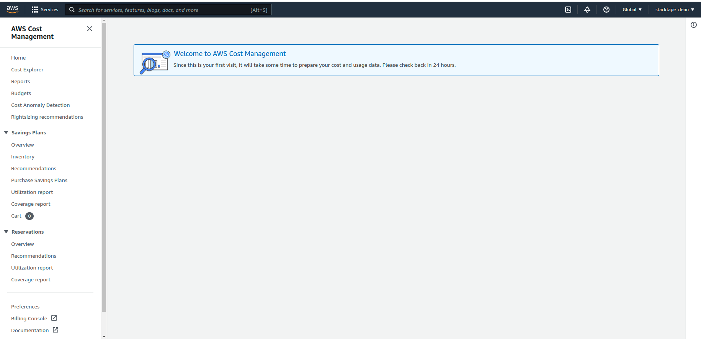
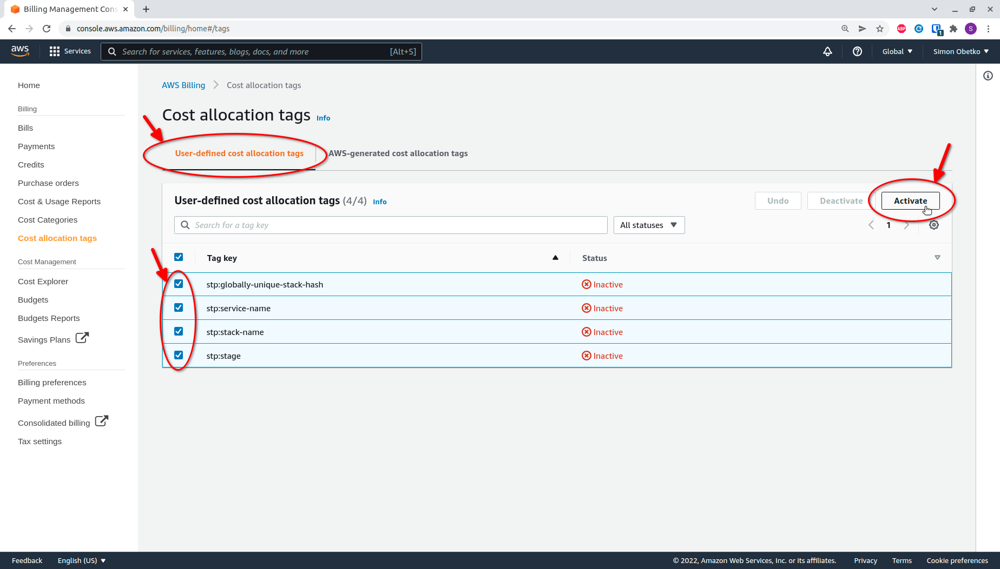
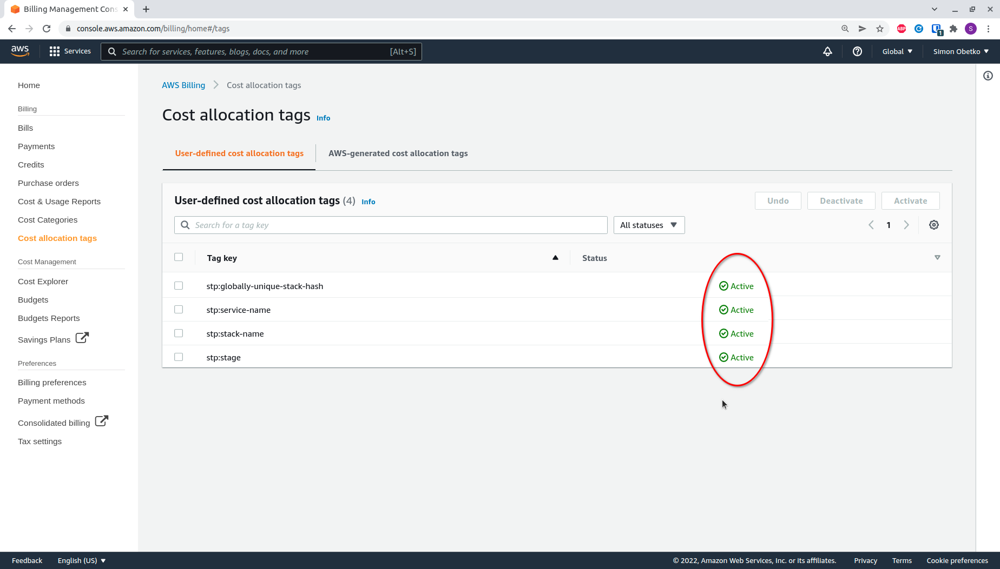

 
 

To use [budget control](/configuration/budget-control), you must:

1.  Enable Cost Explorer in your AWS account (if you have not used it before). This must be done using the **root account**.
2.  Activate Stacktape cost allocation tags in the AWS Console. This must also be done using the **root account**.

This guide will walk you through both of these steps.

<Warning>

To complete this tutorial, you must be logged in as the AWS **root user**.

</Warning>

## 1. Enabling Cost Explorer

### 1.1. Go to the Cost Explorer page

Log in to the AWS Management Console as the **root user** and navigate to the [Cost Explorer page](https://console.aws.amazon.com/billing/home#/costexplorer) in the billing section.

### 1.2. Launch Cost Explorer

Click the **Launch Cost Explorer** button.

If this is your first time launching Cost Explorer, you will see the following message:

<Warning>

It can take up to 24 hours for Cost Explorer to be activated. This is an AWS limitation.

</Warning>

## 2. Activate cost allocation tags

Activating cost allocation tags allows Stacktape to correctly aggregate the costs of the resources in your stacks. Stacktape automatically tags the resources in your stacks with custom tags. For these tags to be usable by Cost Explorer, you must activate them as cost allocation tags.

### 2.1. Go to the Cost allocation tags page

Log in to the AWS Management Console and navigate to the [Cost allocation tags tab](https://console.aws.amazon.com/billing/home#/tags) in the billing section.

### 2.2. Activate the required cost allocation tags

The list will show all the tags that have been previously used to tag a resource in this account. If you have already deployed a stack with Stacktape, the required tags should be listed here.

The following tags are required:

*   `stp:globally-unique-stack-hash`
*   `stp:service-name`
*   `stp:stack-name`
*   `stp:stage`

<Warning>

It can take up to 24 hours for these tags to appear in the console after being used. This is an AWS limitation.

</Warning>

Select all the required tags and click the **Activate** button in the top-right corner.

After activation, the tags should be marked as **Active**.

<Warning>

It can take up to 24 hours after activating the tags before you can use them in [budget control](/configuration/budget-control). This is an AWS limitation.

</Warning>

