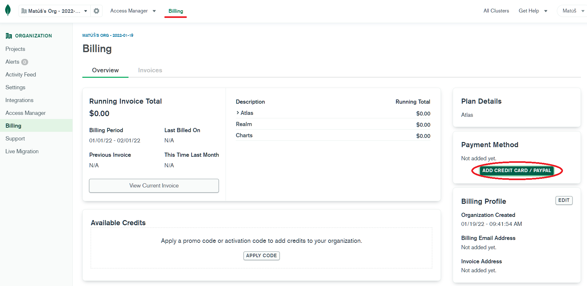
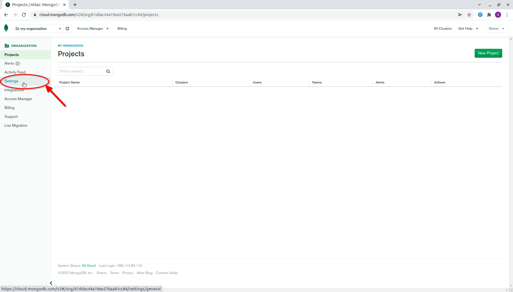
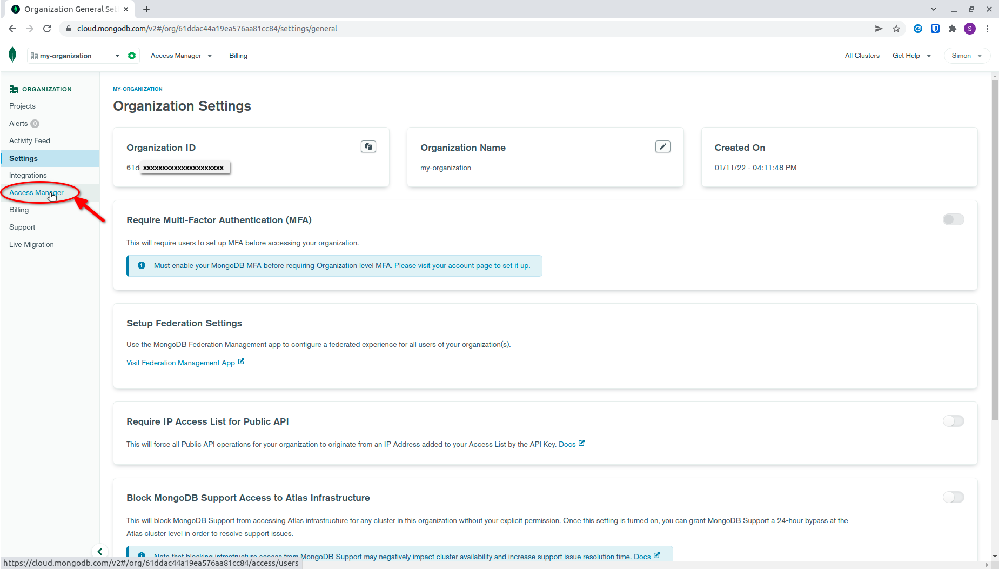
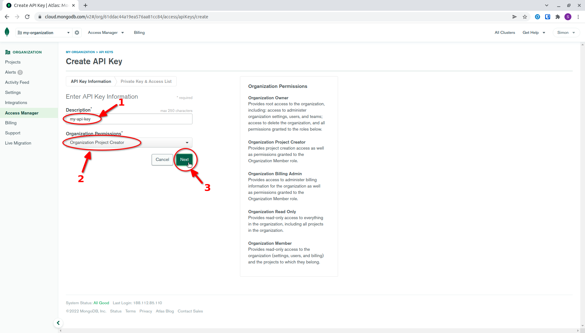
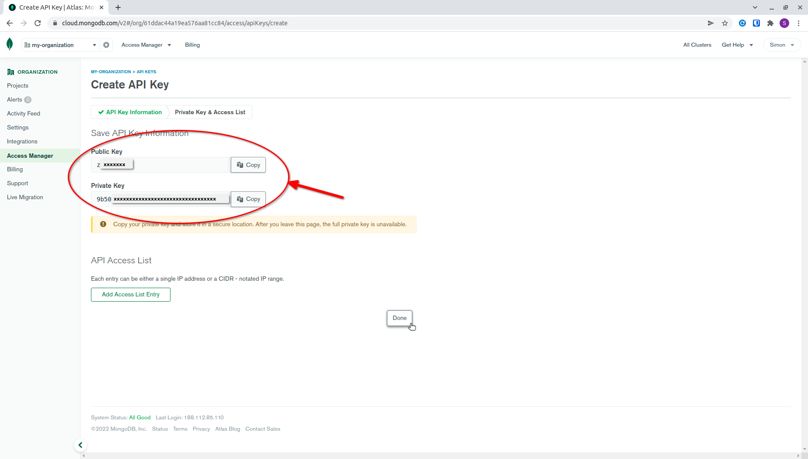

 
 

[MongoDB Atlas clusters](/3rd-party-resources/mongo-db-atlas-clusters) are managed outside of AWS and require you to configure a [MongoDB Atlas provider](/3rd-party-resources/mongo-db-atlas-clusters#provider-configuration). To configure the provider, you need an `organizationId`, a `publicKey`, and a `privateKey`. This guide will walk you through obtaining these credentials.

## 1. Create a MongoDB Atlas account

If you do not have a MongoDB Atlas account, you can [create one here](https://account.mongodb.com/account/register).

After you create your account, you will be prompted to choose a deployment option. You can skip this, as Stacktape will handle the database creation and deletion for you.

## 2. Add a payment method

Next, you need to add a payment method. Go to the billing page and click the **ADD PAYMENT METHOD** button.

## 3. Create an organization

From the dropdown menu in the top-right corner, navigate to the **Organizations** screen.

Click the **Create New Organization** button.

Now, you need to:

1.  Enter an organization name.
2.  Select **MongoDB Atlas** as your cloud service.

Click the **Next** button.

On the following screen, you can optionally add members to your organization. Click the **Create Organization** button.

## 4. Get your Organization ID

After creating the organization, you will be redirected to the organization's space. Navigate to **Settings**.

On the **Settings** page, you will see your `organizationId`.

## 5. Get your API keys

Navigate to the **Access Manager** page within the organization's space.

In the **Access Management** page, select the **API Keys** tab and click the **Create API Key** button.

On the following screen:

1.  Enter a description for the key.
2.  Select `Organization Project Creator` or higher for the permissions.

Click the **Next** button.

On the next screen, you will see your **public** and **private** keys. The private key will not be available after you leave this page. We recommend storing both keys in a [secret](/security-resources/secrets).

